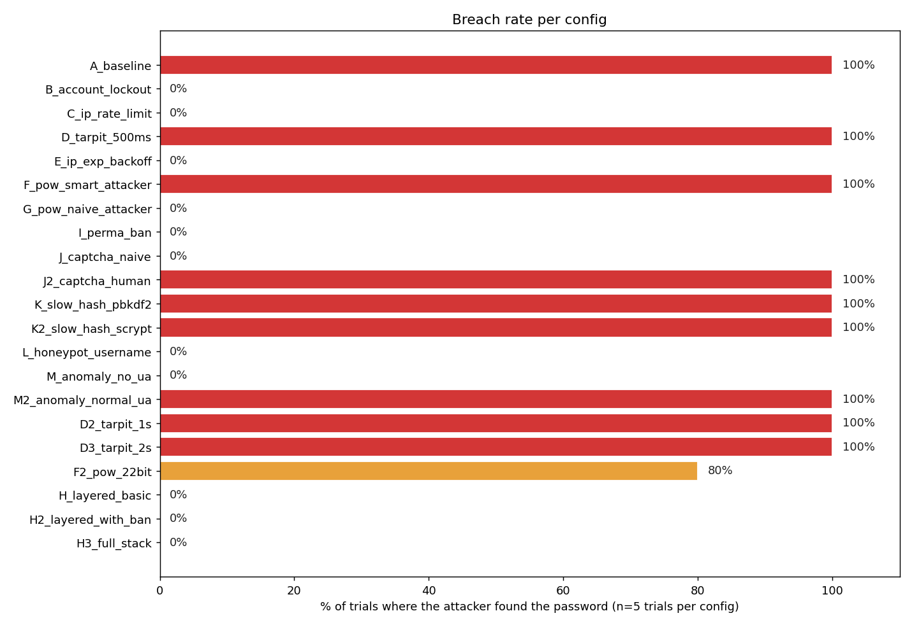

# Measuring Online Password Guessing Resistance
### A reproducible measurement framework for authentication defenses

Austin & Ian · CS 47205/57205 · Project 3

<!-- Speaker note (~30s):
Hi, today we're presenting our measurement framework for online password
guessing defenses. We'll cover the testbed, the ten defenses we measured,
the results, and what to actually deploy.
-->

---

## The problem (1 min)

Online password guessing is **the single most common identity attack** on the public Internet.

Every authentication system ships a different mix of defenses:
- account lockout, rate limiting, progressive delays, CAPTCHAs, MFA, anomaly detection, bot filters …

**Question:** how do these defenses actually compare under controlled, repeatable measurement?

**Goal of this project:**
1. Build an attacker + target framework that can drive any one of those defenses through hundreds of trials.
2. Produce a comparable, system-level security profile so two configurations can be argued about with data.

---

## Threat model (1 min)

We model an **online, single-source attacker**:

| | In scope | Out of scope (future work) |
|---|---|---|
| Attempts | Sequential HTTP login requests | Parallel / distributed |
| Source IPs | One | Botnets, proxy pools |
| Targets | One known username | Credential stuffing, password spraying |
| Wordlist | Real public corpora (SecLists 10k) | Adaptive / personalised guesses |
| Knowledge | Black-box: only HTTP responses | Insider / source-code visibility |

The attacker has **capability tiers** — naive bot, PoW-solving bot, human-in-the-loop — and we measure how each defense fares against each tier.

---

# Section 1 — Testbed

---

## Testbed architecture (2 min)

Four-piece split, each independently configurable:

```
login-lab/   →  Flask target. Defenses configured by env vars.
attack/      →  HTTP guesser. Attacker capabilities by CLI flags.
scripts/     →  Orchestrator. Boots target, runs attack, aggregates results.
passwords/   →  SecLists corpus, already on disk.
```

For every trial: spawn a fresh Flask process on a fresh port → wait for `/health` → fire the attack → tear down. **No state leakage between configurations.**

Reproducibility primitives:
- All randomness seeded (`--seed`)
- Per-attempt CSV logs with status code + reason
- All charts regenerable from the JSON

---

## Wordlist methodology (1.5 min)

Old approach: a fixed wordlist with the password at line 41. **One data point.**

New approach: every trial gets its own wordlist, generated by [`scripts/build_wordlist.py`](scripts/build_wordlist.py):

1. Sample N entries (default 100) from `SecLists/Common-Credentials/10k-most-common.txt`.
2. Insert the target password at a uniformly-random position.
3. Record source, seed, target position in a sidecar JSON.

With **5 trials per config** the same defense gets exercised against 5 different target depths → distribution, not anecdote.

The 22 configs × 5 trials = **110 attack runs** in our headline experiment, ~57 minutes wall-clock.

---

## Attacker capability tiers (1.5 min)

The same `attack/main.py` simulates several attacker classes via flags:

| Flag | Models |
|---|---|
| (default) | Naive scripted bot — sends username/password, no JS, no humans |
| `--solve-pow` | Sophisticated bot with a SHA-256 PoW solver in its loop |
| `--solve-captcha` | Human-in-the-loop attacker (or commercial solver service) |
| `--no-user-agent` | Lazy script that didn't bother spoofing browser headers |
| `--no-auto-reset-on-block` | Honest measurement — blocks really stop the run |

This matters because **defenses that beat one tier are trivially bypassed by another.** We'll see this in the results.

---

# Section 2 — Protections

---

## Ten defenses, four required categories (2 min)

| Project category | Mechanism | Env knob |
|---|---|---|
| **Account lockout** | Account lockout | `ACCOUNT_MAX_FAILURES`, `ACCOUNT_LOCKOUT_SECONDS` |
| **Rate limiting** (IP-based) | IP rate limit | `IP_MAX_ATTEMPTS`, `IP_WINDOW_SECONDS` |
| **Rate limiting** (IP-based) | Permanent IP ban | `PERMA_BAN_THRESHOLD` |
| **Progressive delays** | Tarpit (fixed) | `TARPIT_SECONDS` |
| **Progressive delays** | IP exponential backoff | `IP_BACKOFF_BASE_SECONDS`, `IP_BACKOFF_CAP_SECONDS` |
| Cost amplification | Slow password hash | `PASSWORD_HASH_METHOD` |
| Bot vs human filters | Proof-of-work challenge | `POW_FAILURES_BEFORE_CHALLENGE`, `POW_DIFFICULTY_BITS` |
| Bot vs human filters | CAPTCHA challenge | `CAPTCHA_FAILURES_BEFORE_CHALLENGE` |
| Bot vs human filters | Honeypot usernames | `HONEYPOT_USERNAMES` |
| Bot vs human filters | Header anomaly detection | `ANOMALY_BLOCK_MISSING_HEADERS` |

All ten implemented in ~280 lines in [`login-lab/routes/auth.py`](login-lab/routes/auth.py).

---

## How they're measured (1 min)

Every config produces six metrics:

1. **Breach rate** — fraction of trials where the attacker hit the password.
2. **Median time-to-crack** — wall-clock seconds, with min/max range.
3. **Effective request rate** — requests/sec the attacker could sustain.
4. **Response status mix** — counts of 401/423/429/403 by reason (PoW required, CAPTCHA, etc.).
5. **First-hit position** — where in the wordlist the password landed in the breached trials.
6. **Position vs time** — scatter showing how time-to-crack scales with target depth.

These six together form a "**security profile**" — a fingerprint that lets two configs be compared visually.

---

# Section 3 — Results

---

## Summary across 22 configurations × 5 trials (1.5 min)



**Three clean groups:**

- 🟥 **Always breached (100%)** — the defense was a slow-down, not a stop.
- 🟩 **Always blocked (0%)** — the defense was a hard stop.
- 🟧 **F2_pow_22bit at 80%** — the only probabilistic outcome.

---

## Hard stoppers (1 min)

Every trial against these configs ended with the attacker exhausting the wordlist without a hit:

- **Account lockout** (5 fail → 60s) — 0% breach, 3.4s median
- **IP rate limit** (10/30s) — 0% breach, 4.8s
- **IP exponential backoff** (0.25s base, cap 8s) — 0% breach, 3.5s
- **Permanent IP ban** (8 failures → blacklist) — 0% breach, 3.8s
- **PoW vs naive bot** — 0% breach, 3.7s
- **CAPTCHA vs naive bot** — 0% breach, 4.5s
- **Honeypot username** (admin) — 0% breach, 3.2s (banned on first request)
- **Header anomaly** (no User-Agent) — 0% breach, 3.7s
- **All three layered configs** — 0% breach, ~30s

---

## Slow-downs only (1 min)

These cost the attacker time, but the password came out:

| Config | Median time | Slowdown vs baseline |
|---|---|---|
| A_baseline | 16s | 1× |
| K2_slow_hash_scrypt (default werkzeug params) | 12s | **0.7× — worse than baseline‼️** |
| J2_captcha_human (human solver) | 12s | 0.75× |
| F_pow_smart_attacker (18-bit) | 14s | 0.9× |
| K_slow_hash_pbkdf2 (600k iters) | 23s | 1.5× |
| D_tarpit_500ms | 62s | 4× |
| F2_pow_22bit (smart, 22-bit) | 95s (80% breach) | 6× |
| D2_tarpit_1s | 112s | 7× |
| **D3_tarpit_2s** | **214s** | **13×** |

Tarpit's slowdown is **linear in wordlist depth × per-failure delay**. Predictable, tunable.

---

## Surprising finding 1: scrypt was barely a defense (45s)

`scrypt:32768:8:1` — werkzeug's default — finished **faster** than baseline (12s vs 16s).

Why: server-side scrypt cost is dominated by **n=32768**, which is ~16ms on this machine. Add HTTP roundtrip variance and the noise eats the signal.

`pbkdf2:sha256:600000` was meaningfully slower (23s, 1.5× baseline).

> **Lesson for the project:** "we use a slow hash" is not a defense unless the parameters are tuned for the target hardware. Production deployments should benchmark and target ~100ms per verify.

---

## Surprising finding 2: PoW has a sharp probabilistic cliff (45s)

| Config | Breach rate |
|---|---|
| F_pow_smart_attacker (18-bit) | 100% — 14s |
| F2_pow_22bit (22-bit) | **80% — 95s** |

At 22-bit difficulty the attacker's solver hits its 5M-attempt budget often enough that **one trial in five times out**. The defense moves from a slow-down to a probabilistic block.

This is a real configuration sweet spot — past a certain difficulty you cross from "annoying" to "actually breaking" the attacker, but the line depends on attacker hardware.

---

## Layered defense converges (1 min)

H, H2, H3 stack progressively more mechanisms:

| Config | Defenses | Median time |
|---|---|---|
| H_layered_basic | lockout + rate-limit + tarpit + PoW | 30s |
| H2_layered_with_ban | + perma-ban + slow hash | 30s |
| H3_full_stack | + CAPTCHA + honeypot + anomaly | 30s |

**Identical wall-clock, identical 0% breach.** Once account-lockout fires at attempt 5, the other defenses never get a chance to activate.

That's a feature, not a bug: the **cheapest defense wins**, and the rest are insurance for when it fails or is misconfigured. Defense-in-depth is about **failure modes**, not steady-state performance.

---

# Section 4 — Recommendations

---

## What to actually deploy (1.5 min)

Based on the data, a minimum-viable defense stack is **three layers**:

1. **Account lockout** — cheap, hard-stops the attacker on a known username.
   *Configure: ~5 failures → ≥60s lockout. Reset on legitimate login.*

2. **IP-based throttling** — protects when the attacker rotates usernames.
   *Configure: sliding window or exponential backoff. Cap, don't ban-permanent, to avoid IP-reuse pain.*

3. **Slow password hash** — makes every guess expensive even if the attacker bypasses online defenses.
   *Configure: argon2id or pbkdf2 with iterations tuned to ~100ms on prod hardware. **Verify the cost — defaults are weak.**

**Don't rely on** (against motivated attackers): tarpits alone, default-parameter scrypt, header anomaly checks (trivially defeated by a User-Agent string), low-bit PoW.

**Useful add-ons:** honeypot usernames, geographic anomaly scoring, MFA on sensitive accounts.

---

## Reproducing this study (30s)

```bash
git clone <repo>
cd Research-Project
python -m venv .venv && .venv/Scripts/activate
pip install -r requirements.txt

# Refresh wordlists (uses existing download scripts)
python passwords/download-scripts/run_all.py

# Full statistical run (~60 min on a laptop)
python scripts/benchmark_defenses.py --trials 5 --seed 1337

# Charts & HTML report
python scripts/make_charts.py --open
```

Every artifact (CSVs, server logs, generated wordlists, charts) lands under `login-lab/logs/benchmark/<UTC stamp>/`.

---

## Future work / extensions

- **Distributed attacker** — multi-IP, multi-process to expose IP-only defenses.
- **Cross-system comparison** — point the same attack client at WordPress (with `Limit Login Attempts Reloaded`), Authelia, Gitea, Keycloak. The framework already speaks plain HTTP.
- **Adaptive attackers** — attackers that observe response timing/codes and switch strategy mid-run.
- **Real CAPTCHA / MFA endpoints** — replace our magic-token stubs with hCaptcha or TOTP.
- **Cost modeling** — translate "13× slowdown" into dollar cost per credential at cloud-attacker rates.

---

## Questions?

**Repo:** `github.com/Yoyojesus/Research-Project`

**Key artifacts:**
- [`PROJECT3_OVERVIEW.md`](PROJECT3_OVERVIEW.md) — deliverable mapping
- [`login-lab/routes/auth.py`](login-lab/routes/auth.py) — all 10 mechanisms
- [`scripts/benchmark_defenses.py`](scripts/benchmark_defenses.py) — orchestrator
- [`scripts/render_report.py`](scripts/render_report.py) — chart pipeline

**Headline numbers:**
- 22 configurations × 5 trials = 110 measured attack runs
- ~57 min wall-clock for the full sweep
- 11 of 22 configs blocked the attacker 100% of trials
- F2_pow_22bit was the only probabilistic outcome (80%)
