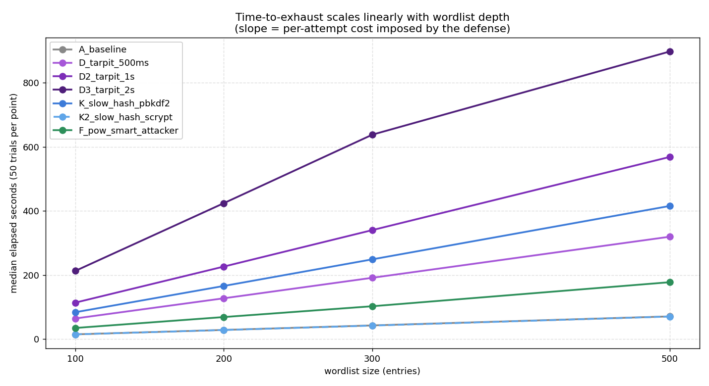
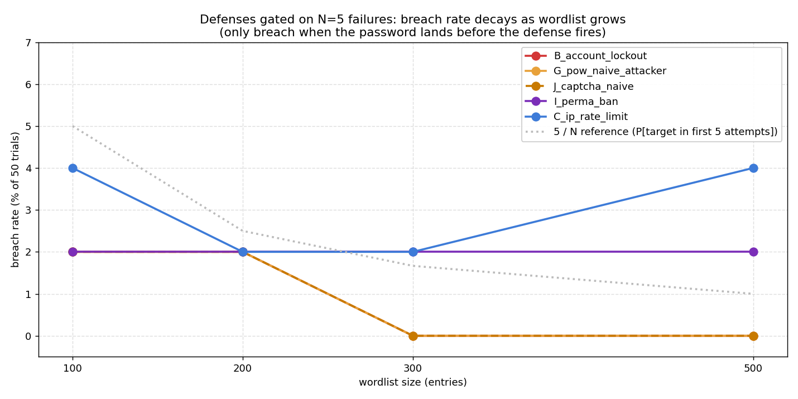

# Measuring Online Password Guessing Resistance

A reproducible measurement framework for authentication defenses

Austin & Ian . CS 47205/57205 . Project 3

<!-- ~30s. Open with the goal: we want to compare login defenses with data, not anecdote. -->

---

## The problem

Online password guessing is the single most common identity attack on the public Internet.

Every authentication system ships a different mix of defenses: account lockout, rate limiting, progressive delays, CAPTCHAs, MFA, anomaly detection, bot filters.

These defenses interact in non-obvious ways and are often misconfigured.

**Question:** how do these defenses actually compare under controlled, repeatable measurement?

**Goal:** build attacker + target framework, drive each defense through hundreds of trials, produce a comparable security profile.

---

## Threat model

We model an online, single-source attacker.

| Dimension | In scope | Out of scope (future work) |
|---|---|---|
| Attempts | Sequential HTTP login requests | Parallel / distributed |
| Source IPs | Single IP | Botnets, proxy pools |
| Targets | One known username | Credential stuffing, password spraying |
| Wordlist | Real public corpora (SecLists 10k) | Adaptive / personalised guesses |
| Knowledge | Black-box: only HTTP responses | Insider / source-code visibility |

Attacker capability tiers (naive bot, header-aware bot, PoW-solving bot, human-in-the-loop) are explicit knobs in the framework.

---

# Section 1 - Testbed

---

## Testbed architecture

Four pieces, each independently configurable.

- **Target system**: a small Flask login service. Every defense is a tunable knob.
- **Attacker client**: a single password-guessing tool with capability flags for naive bots, PoW-solving bots, and human-in-the-loop attackers.
- **Orchestrator**: boots a fresh target per configuration, runs the attacker, aggregates results.
- **Wordlist source**: real public corpora (SecLists), sampled per trial.

Each trial gets an isolated process and a fresh port - no state leaks between configurations. Every measurement is seeded and reproducible from the same inputs.

---

## Wordlist methodology

Old approach: one fixed wordlist with the password at a known position. One data point.

New approach: every trial gets its own randomized wordlist.

1. Sample N entries from a real public password corpus (SecLists 10k).
2. Insert the target password at a uniformly-random position.
3. Record the seed and target position so the trial is reproducible.

50 trials per config x 21 configs x 4 wordlist sizes (100 / 200 / 300 / 500) = 3,500+ trial measurements in the headline sweep. Each defense exercised against 50 different target depths per wordlist size gives a real measurement distribution rather than a single point.

The 100-word run completed in 13.7 hours; the longer wordlist runs were stopped after the layered configs because the tarpit and high-bit PoW configs would have run for days.

---

## Attacker capability tiers

| Tier | Behaviour |
|---|---|
| Naive scripted bot | Sends username and password. No JavaScript, no humans, no header spoofing. |
| Header-aware bot | Same as above, but spoofs a normal browser User-Agent. |
| PoW-solving bot | Includes a SHA-256 puzzle solver in its loop. |
| Human-in-the-loop | A human (or commercial solver service) handles CAPTCHAs. |

Same attacker tool models all four tiers - we toggle behaviour per run to compare each defense across the spectrum.

---

# Section 2 - Protections

---

## Ten defenses, four required categories

| Category | Mechanism | What it does |
|---|---|---|
| **Account lockout** | Account lockout | Freezes the account for a duration after N consecutive failures. |
| **Rate limiting** | IP rate limit | Caps attempts from a single IP in a sliding window. |
| **Rate limiting** | Permanent IP ban | Blacklists the IP after K failures within a long window. |
| **Progressive delays** | Tarpit | Server sleeps a fixed amount before each failed response. |
| **Progressive delays** | IP exponential backoff | Per-IP cooldown that doubles with each failure, with a cap. |
| Cost amplification | Slow password hash | pbkdf2 or scrypt to inflate per-attempt CPU cost. |
| Bot vs human filter | Proof-of-work | Server demands a SHA-256 puzzle after N failures. |
| Bot vs human filter | CAPTCHA challenge | Server demands a human-solvable token after N failures. |
| Bot vs human filter | Honeypot usernames | Contact with watched usernames triggers an instant ban. |
| Bot vs human filter | Header anomaly detection | Block requests missing typical browser headers. |

Required project categories highlighted in bold.

---

## How they're measured

Every config produces six metrics.

1. **Breach rate** - fraction of trials where the attacker hit the password.
2. **Median time-to-crack** - wall-clock seconds, with min/max range.
3. **Effective request rate** - requests/sec the attacker could sustain.
4. **Response status mix** - counts of 401 / 423 / 429 / 403 by reason.
5. **First-hit position** - where in the wordlist the password landed in the breached trials.
6. **Position vs time** - scatter showing how time-to-crack scales with target depth.

These six together form a security profile that lets two configs be compared visually.

---

# Section 3 - Results

---

## Summary across 21 configs x 50 trials (100-word run)

Three regimes in the data.

- **Hard block (0%)** - 3 configs. Defense fires from request 1; attacker never gets a foothold.
- **Lottery window (2-4%)** - 8 configs. Defense gated on N=5 failures; breaches only when the password happens to land in attempts 1-5.
- **Slow-down only (100%)** - 9 configs. Attacker just waits; password comes out every time.

Plus one probabilistic outcome: F2_pow_22bit at 82% breach (solver sometimes blew its 5M-attempt budget).

---

## Hard block (0% breach across 50 trials)

Defense fires from request 1 - the attacker never reaches a state where the password could be tried.

| Config | Median elapsed | Why it blocks instantly |
|---|---|---|
| L_honeypot_username | 0.5s | Username 'admin' triggers permanent ban on request 1 |
| M_anomaly_no_ua | 0.5s | Missing User-Agent flagged on request 1 |
| E_ip_exp_backoff | 0.7s | Per-IP backoff hits cap before any breach window opens |

---

## Lottery window (2-4% breach across 50 trials)

These defenses gate on N consecutive failures - so they leak whenever the password happens to land in those first N attempts. With a 100-word list the lottery is roughly 5/100 = 5%; the data tracks that prediction.

| Config | Breach | Median elapsed | Defense threshold |
|---|---|---|---|
| B_account_lockout | 2% | 1.3s | 5 fails -> 60s lock |
| G_pow_naive_attacker | 2% | 1.3s | 5 fails -> PoW required (no solver) |
| J_captcha_naive | 2% | 1.3s | 5 fails -> CAPTCHA required (no solver) |
| I_perma_ban | 2% | 1.8s | 8 fails -> permanent ban |
| C_ip_rate_limit | 4% | 2.1s | 10 attempts / 30s window |
| H_layered_basic | 2% | 26.8s | account lockout dominates the layered stack |
| H2_layered_with_ban | 2% | 30.4s | adds perma-ban + slow hash |
| H3_full_stack | 4% | 30.1s | every mechanism enabled |

These breaches are all-or-nothing: if the password lands at position 1-5 the attacker hits it before the defense activates, otherwise zero. Median first-success position across all lottery breaches: 3.

---

## Slow-down only (100% breach across 50 trials)

These cost the attacker time, but the password comes out every trial.

| Config | Median time | Slowdown vs baseline |
|---|---|---|
| A_baseline | 14.5s | 1.0x |
| K2_slow_hash_scrypt (default werkzeug params) | 14.4s | 1.0x - no slowdown |
| M2_anomaly_normal_ua | 14.4s | 1.0x - bypassed by spoofed UA |
| J2_captcha_human (human solver) | 14.5s | 1.0x |
| F_pow_smart_attacker (18-bit) | 34.4s | 2.4x |
| D_tarpit_500ms | 64.0s | 4.4x |
| K_slow_hash_pbkdf2 (600k iters) | 83.5s | 5.8x |
| D2_tarpit_1s | 113.5s | 7.8x |
| **D3_tarpit_2s** | **212.5s** | **14.7x** |

F2_pow_22bit lands here at 82% breach with median 305.9s (21x baseline) - the only config where the attacker sometimes ran out of solver budget.

Tarpit and slow-hash slowdowns are linear in wordlist depth - predictable and tunable.

---

## Finding 1: scrypt was barely a defense

`scrypt:32768:8:1` (werkzeug's default) was statistically indistinguishable from baseline at 50 trials (14.40s vs 14.46s).

- Server-side scrypt cost dominated by n=32768 (~16ms on test hardware).
- Lost in HTTP roundtrip noise.
- `pbkdf2:sha256:600000` was meaningfully slower (83.5s, 5.8x baseline).

**Lesson:** "we use a slow hash" is not a defense unless parameters are tuned for the target hardware. Production should benchmark and aim for ~100ms per verify. Don't trust library defaults.

---

## Finding 2: PoW sits on a probabilistic cliff

| Config | Difficulty | Breach rate (50 trials) | Median time |
|---|---|---|---|
| F_pow_smart_attacker | 18-bit | 100% | 34.4s |
| F2_pow_22bit | 22-bit | **82%** | 305.9s |

At 22-bit difficulty the attacker's solver hits its 5M-attempt-per-puzzle budget on roughly 1 in 5 trials. The defense moves from a slow-down to a probabilistic block. Real configuration sweet spot - but the line depends on attacker hardware.

Interesting follow-on: at 200-word the same F2_pow_22bit config breached on 30/33 trials (91%) - more wordlist depth meant the solver hit more puzzles total but kept squeaking through. The "cliff" is a function of solver-budget per puzzle, not just bits.

---

## Finding 3: time-to-exhaust scales linearly with wordlist depth

Each line is one defense exercised at four wordlist sizes (50 trials per point). The slope is the per-attempt cost the defense imposes:

- D3_tarpit_2s adds ~2s per failed attempt (bounded only by tarpit setting)
- K_slow_hash_pbkdf2 adds ~0.8s per attempt (CPU-bound, server-side)
- F_pow_smart_attacker adds ~0.4s per attempt (CPU-bound, attacker-side)
- A_baseline / K2_scrypt overlap perfectly - scrypt added zero observable cost

Scaling is the right way to reason about online-guessing defenses: you're buying time per attempt, and the question is whether the attacker's budget exceeds (cost-per-attempt x wordlist depth).

---

## Finding 4: lottery-window breaches predict the 5/N curve

Defenses that activate after N=5 failures have a structural blind spot: if the password lands in the first 5 wordlist entries, the attacker hits it before the defense fires. P(breach) ~= 5/N where N is the wordlist size.

- 100-word: B_account_lockout, G_pow_naive, J_captcha_naive all breached 1/50 = 2%
- 200-word: same configs still 2% (within sampling noise of 5/200 = 2.5%)
- 300-word and 500-word: most fall to 0% (5/300 = 1.7%, 5/500 = 1%)
- I_perma_ban (gated on 8 fails, not 5) holds at 2% across all sizes - 8/N is a slower decay

Operational implication: defenses with finite warm-up windows always leak at small wordlists. Combine with a slow-hash or tarpit that is active from request 1.

---

## Layered defense converges

| Config | Defenses | Median time | Breach |
|---|---|---|---|
| H_layered_basic | lockout + rate-limit + tarpit + PoW | 26.8s | 2% |
| H2_layered_with_ban | + perma-ban + slow hash | 30.4s | 2% |
| H3_full_stack | + CAPTCHA + honeypot + anomaly | 30.1s | 4% |

Wall-clock is dominated by account-lockout - once it fires at attempt 5, the other defenses never get exercised. The 2-4% breach rate is the same lottery-window effect: the password sometimes lands in attempts 1-5 before lockout activates.

That's a feature, not a bug: the cheapest defense wins, the rest are insurance for when it fails or is misconfigured. Defense-in-depth is about failure modes, not steady-state performance.

---

# Section 4 - Recommendations

---

## What to actually deploy

Minimum-viable stack: three layers with tuned parameters.

| Layer | Configuration |
|---|---|
| 1. Account lockout | ~5 failures -> >=60s lockout. Reset on legitimate login. Cheap, hard-stops named-target attacks. |
| 2. IP-based throttling | Sliding window or exponential backoff. Cap, don't permanent-ban (avoid IP-reuse pain). |
| 3. Slow password hash | argon2id or pbkdf2, tuned to ~100ms/verify on prod hardware. Verify cost - defaults are weak. |

**Don't rely on** (against motivated attackers): tarpits alone, default-parameter scrypt, header anomaly checks (trivially defeated by a User-Agent string), low-bit PoW.

**Useful add-ons:** honeypot usernames, geographic anomaly scoring, MFA on sensitive accounts.

---

## Future work

Where the framework can be extended.

- **Distributed attacker** - multi-IP, multi-process to expose IP-only defenses.
- **Cross-system comparison** - point the same attack client at WordPress, Authelia, Gitea, Keycloak. Framework already speaks plain HTTP.
- **Adaptive attackers** - observe response timing and codes, switch strategy mid-run.
- **Real CAPTCHA / MFA endpoints** - replace magic-token stubs with hCaptcha or TOTP.
- **Cost modeling** - translate "13x slowdown" into dollar cost per credential at cloud-attacker rates.

---

# Questions?
