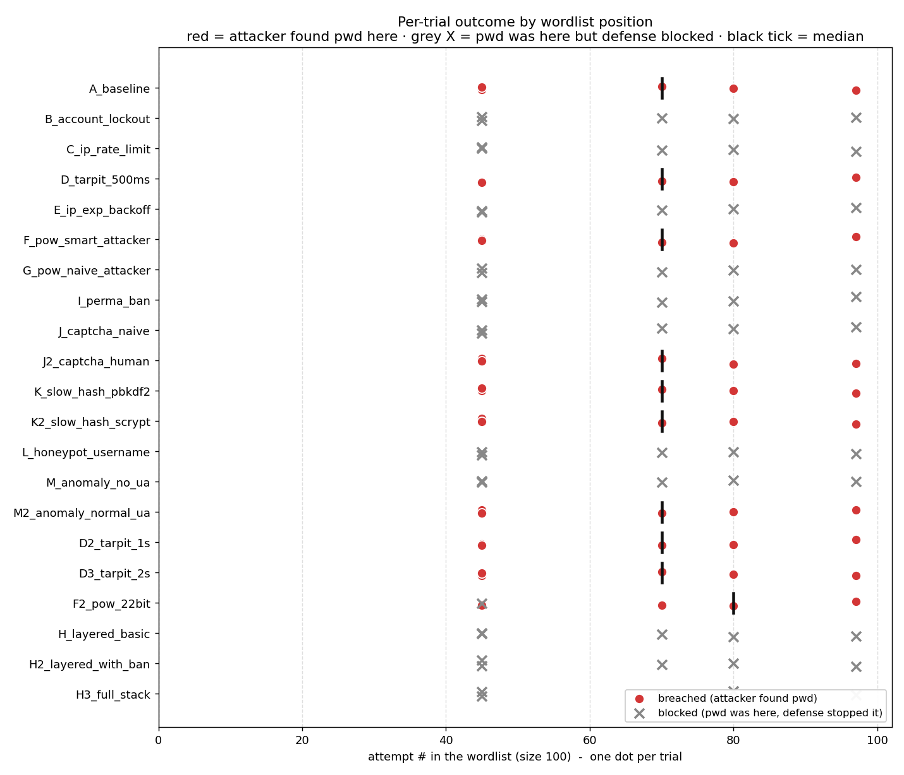
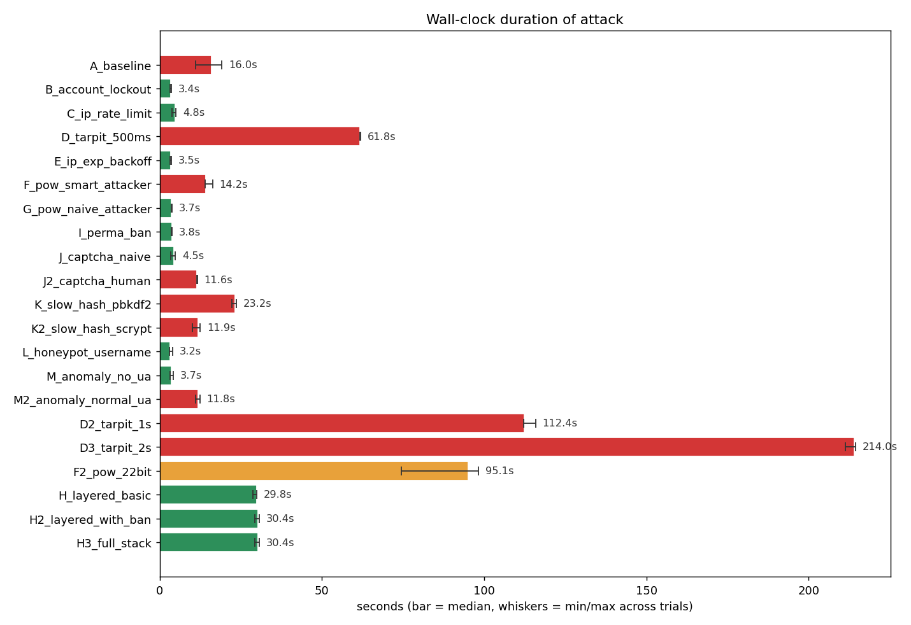
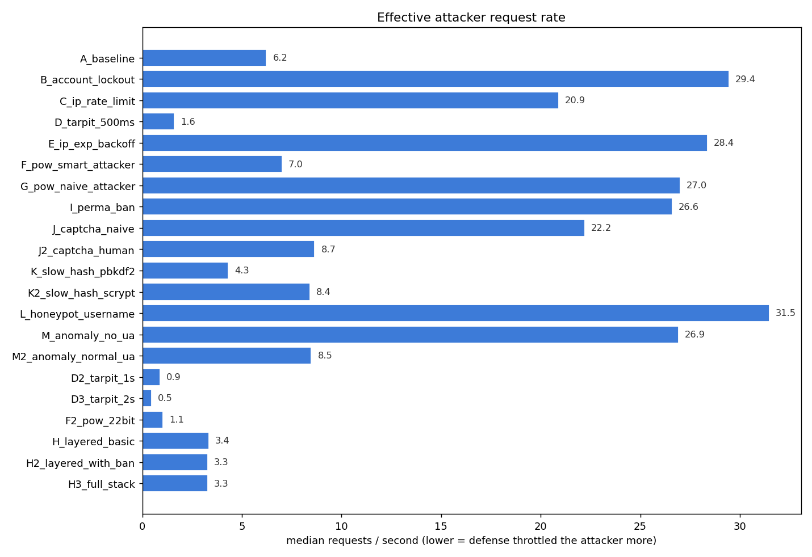
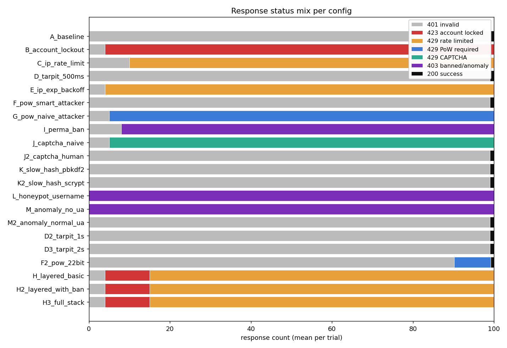
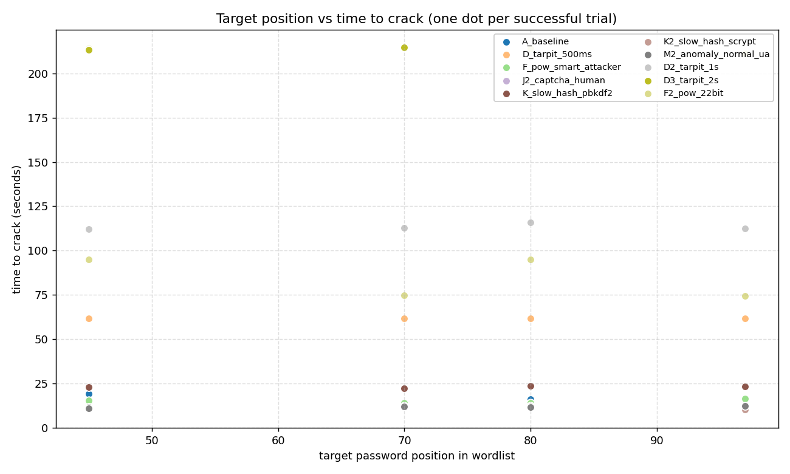

# Login Lab Defense Benchmark - 20260427T160006Z

- Wordlist source: `passwords\raw\SecLists\Common-Credentials\10k-most-common.txt` (100 entries per generated wordlist)
- Trials per config: **5** (target inserted at random position each trial)
- Base RNG seed: `1337`
- Total suite runtime: **56m 59s** across 105 trials (avg 32.6s/trial; _sum-of-trials (no wall-clock recorded)_)

## Verdict matrix

| config | category | breach % | med elapsed | min..max | med req/s | med pos | trials | description |
|---|---|---|---|---|---|---|---|---|
| `A_baseline` | none | 100% **COMPROMISED** | 16.02s | 11.1..19.2 | 6.24 | 70 | 5 | No protections - pure baseline |
| `B_account_lockout` | single | 0% blocked | 3.40s | 3.2..3.6 | 29.45 | - | 5 | Account lockout (5 fail -> 60s) |
| `C_ip_rate_limit` | single | 0% blocked | 4.78s | 3.8..5.1 | 20.91 | - | 5 | IP rate limit (10 / 30s) |
| `D_tarpit_500ms` | single | 100% **COMPROMISED** | 61.75s | 61.7..61.9 | 1.62 | 70 | 5 | Tarpit 0.5s per failure |
| `E_ip_exp_backoff` | single | 0% blocked | 3.52s | 3.2..3.6 | 28.38 | - | 5 | IP exponential backoff (0.25s, cap 8s) |
| `F_pow_smart_attacker` | single | 100% **COMPROMISED** | 14.24s | 14.1..16.3 | 7.02 | 70 | 5 | PoW 18-bit after 5 fails (attacker solves) |
| `G_pow_naive_attacker` | single | 0% blocked | 3.70s | 3.6..3.7 | 27.01 | - | 5 | PoW 18-bit after 5 fails (naive attacker) |
| `I_perma_ban` | single | 0% blocked | 3.76s | 3.7..3.8 | 26.60 | - | 5 | Permanent IP ban after 8 fails / 1h |
| `J_captcha_naive` | single | 0% blocked | 4.50s | 3.4..4.8 | 22.22 | - | 5 | CAPTCHA after 5 fails (naive attacker - no solver) |
| `J2_captcha_human` | single | 100% **COMPROMISED** | 11.55s | 11.4..11.6 | 8.66 | 70 | 5 | CAPTCHA after 5 fails (human-in-loop attacker solves) |
| `K_slow_hash_pbkdf2` | single | 100% **COMPROMISED** | 23.18s | 22.3..23.6 | 4.31 | 70 | 5 | Slow password hash (pbkdf2:sha256:600000) |
| `K2_slow_hash_scrypt` | single | 100% **COMPROMISED** | 11.88s | 10.2..12.5 | 8.41 | 70 | 5 | Slow password hash (scrypt:32768:8:1) |
| `L_honeypot_username` | single | 0% blocked | 3.18s | 3.0..4.1 | 31.49 | - | 5 | Honeypot usernames (attacker hits 'admin') |
| `M_anomaly_no_ua` | single | 0% blocked | 3.72s | 3.2..4.2 | 26.92 | - | 5 | Anomaly detection (attacker omits User-Agent) |
| `M2_anomaly_normal_ua` | single | 100% **COMPROMISED** | 11.77s | 11.1..12.4 | 8.49 | 70 | 5 | Anomaly detection (attacker sends normal User-Agent) |
| `D2_tarpit_1s` | variant | 100% **COMPROMISED** | 112.39s | 112.2..115.8 | 0.89 | 70 | 5 | Tarpit 1s per failure |
| `D3_tarpit_2s` | variant | 100% **COMPROMISED** | 213.99s | 211.3..214.5 | 0.47 | 70 | 5 | Tarpit 2s per failure |
| `F2_pow_22bit` | variant | 80% **partial** | 95.06s | 74.5..98.3 | 1.05 | 75 | 5 | PoW 22-bit after 5 fails (smart attacker) |
| `H_layered_basic` | layered | 0% blocked | 29.84s | 28.7..29.9 | 3.35 | - | 5 | Layered: lockout + IP rate limit + tarpit + PoW |
| `H2_layered_with_ban` | layered | 0% blocked | 30.41s | 29.4..30.7 | 3.29 | - | 5 | Layered + permanent IP ban + slow hash |
| `H3_full_stack` | layered | 0% blocked | 30.38s | 29.4..30.7 | 3.29 | - | 5 | Full stack: every mechanism enabled |

## Charts

## Mechanisms in the lab

- **Account lockout** - after N consecutive failures, the account is frozen.
- **IP rate limit** - caps attempts per IP in a sliding window.
- **Tarpit** - artificial server-side sleep on every failed response.
- **IP exponential backoff** - per-IP cooldown that doubles with each failure.
- **Proof-of-Work** - server demands a SHA-256 puzzle after N failures.
- **Permanent IP ban** - blacklist after K failures within a window.
- **CAPTCHA** - server demands a human-solvable token after N failures.
- **Slow password hash** - pbkdf2 / scrypt to inflate per-attempt CPU cost.
- **Honeypot usernames** - contact with watched usernames triggers an instant ban.
- **Anomaly detection** - block requests missing typical browser headers.