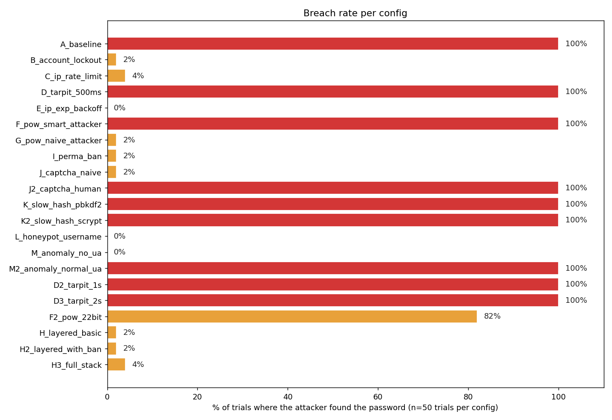
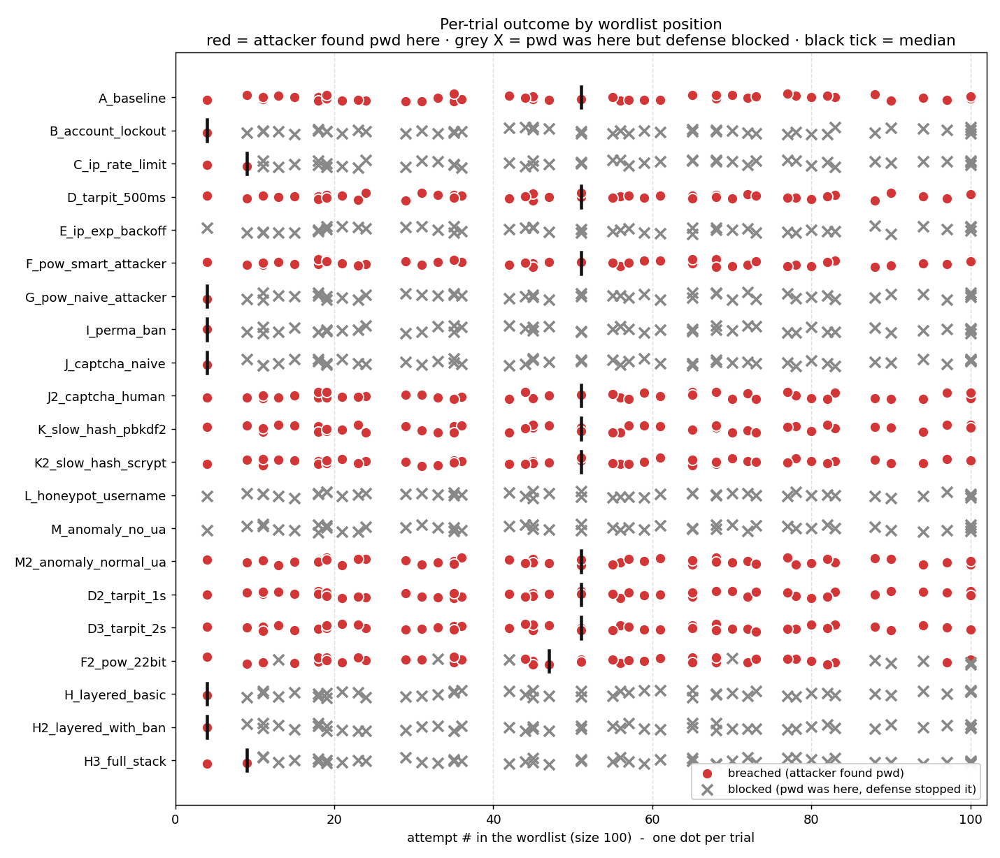
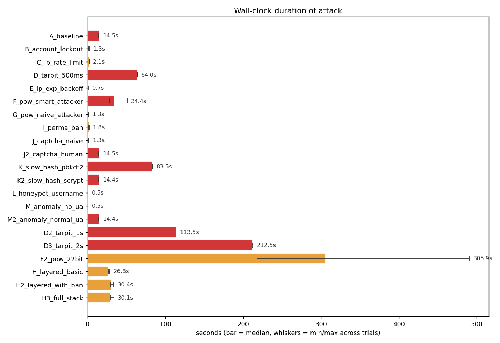
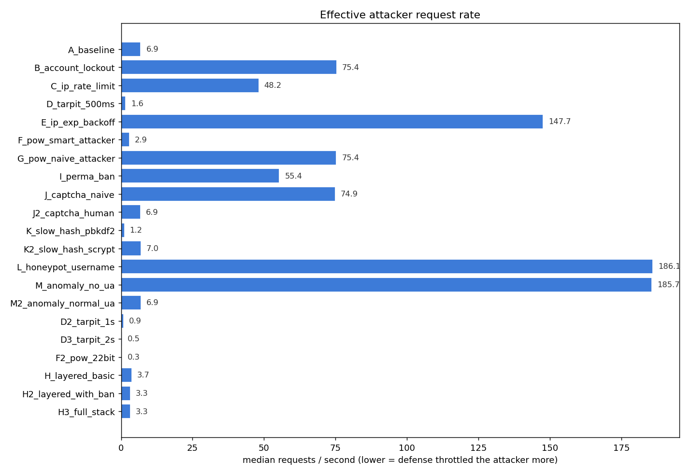
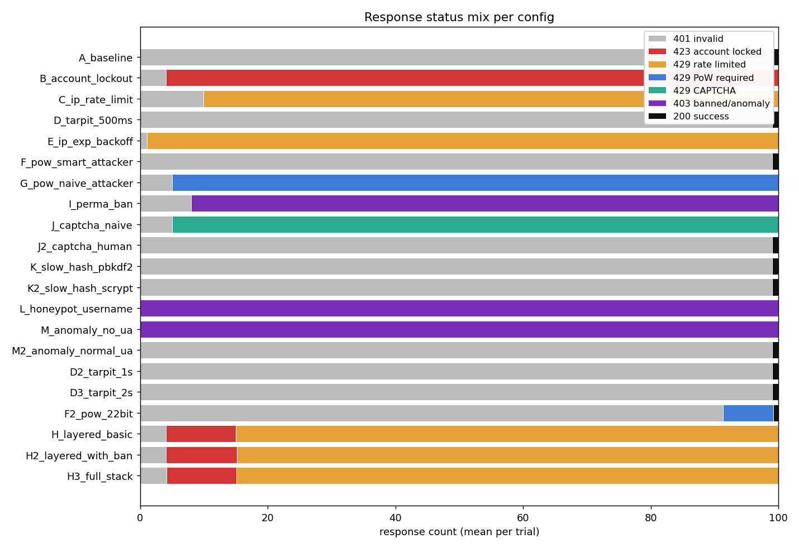
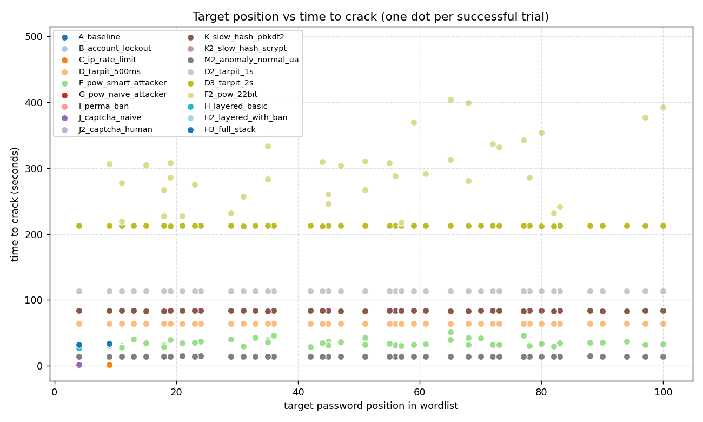

# Login Lab Defense Benchmark - 20260428T164449Z

- Wordlist source: `passwords/raw/SecLists/Common-Credentials/10k-most-common.txt` (100 entries per generated wordlist)
- Trials per config: **50** (target inserted at random position each trial)
- Base RNG seed: `1337`
- Total suite runtime: **13h 43m 23s** across 1050 trials (avg 47.1s/trial; _wall-clock_)

## Verdict matrix

| config | category | breach % | med elapsed | min..max | med req/s | med pos | trials | description |
|---|---|---|---|---|---|---|---|---|
| `A_baseline` | none | 100% **COMPROMISED** | 14.46s | 14.2..14.6 | 6.92 | 51 | 50 | No protections - pure baseline |
| `B_account_lockout` | single | 2% **partial** | 1.33s | 1.2..2.0 | 75.41 | 4 | 50 | Account lockout (5 fail -> 60s) |
| `C_ip_rate_limit` | single | 4% **partial** | 2.08s | 1.9..2.1 | 48.20 | 6 | 50 | IP rate limit (10 / 30s) |
| `D_tarpit_500ms` | single | 100% **COMPROMISED** | 64.02s | 63.9..64.1 | 1.56 | 51 | 50 | Tarpit 0.5s per failure |
| `E_ip_exp_backoff` | single | 0% blocked | 0.68s | 0.7..0.9 | 147.71 | - | 50 | IP exponential backoff (0.25s, cap 8s) |
| `F_pow_smart_attacker` | single | 100% **COMPROMISED** | 34.36s | 28.2..50.8 | 2.91 | 51 | 50 | PoW 18-bit after 5 fails (attacker solves) |
| `G_pow_naive_attacker` | single | 2% **partial** | 1.33s | 1.2..1.4 | 75.36 | 4 | 50 | PoW 18-bit after 5 fails (naive attacker) |
| `I_perma_ban` | single | 2% **partial** | 1.81s | 1.6..1.9 | 55.41 | 4 | 50 | Permanent IP ban after 8 fails / 1h |
| `J_captcha_naive` | single | 2% **partial** | 1.33s | 1.2..1.5 | 74.91 | 4 | 50 | CAPTCHA after 5 fails (naive attacker - no solver) |
| `J2_captcha_human` | single | 100% **COMPROMISED** | 14.51s | 14.3..14.6 | 6.89 | 51 | 50 | CAPTCHA after 5 fails (human-in-loop attacker solves) |
| `K_slow_hash_pbkdf2` | single | 100% **COMPROMISED** | 83.50s | 83.4..83.6 | 1.20 | 51 | 50 | Slow password hash (pbkdf2:sha256:600000) |
| `K2_slow_hash_scrypt` | single | 100% **COMPROMISED** | 14.40s | 14.2..14.5 | 6.95 | 51 | 50 | Slow password hash (scrypt:32768:8:1) |
| `L_honeypot_username` | single | 0% blocked | 0.54s | 0.5..0.6 | 186.06 | - | 50 | Honeypot usernames (attacker hits 'admin') |
| `M_anomaly_no_ua` | single | 0% blocked | 0.54s | 0.5..0.6 | 185.70 | - | 50 | Anomaly detection (attacker omits User-Agent) |
| `M2_anomaly_normal_ua` | single | 100% **COMPROMISED** | 14.42s | 14.2..14.5 | 6.94 | 51 | 50 | Anomaly detection (attacker sends normal User-Agent) |
| `D2_tarpit_1s` | variant | 100% **COMPROMISED** | 113.45s | 113.3..113.5 | 0.88 | 51 | 50 | Tarpit 1s per failure |
| `D3_tarpit_2s` | variant | 100% **COMPROMISED** | 212.47s | 212.3..212.6 | 0.47 | 51 | 50 | Tarpit 2s per failure |
| `F2_pow_22bit` | variant | 82% **partial** | 305.91s | 217.5..490.9 | 0.33 | 47 | 50 | PoW 22-bit after 5 fails (smart attacker) |
| `H_layered_basic` | layered | 2% **partial** | 26.77s | 26.5..28.6 | 3.74 | 4 | 50 | Layered: lockout + IP rate limit + tarpit + PoW |
| `H2_layered_with_ban` | layered | 2% **partial** | 30.38s | 29.9..33.7 | 3.29 | 4 | 50 | Layered + permanent IP ban + slow hash |
| `H3_full_stack` | layered | 4% **partial** | 30.05s | 29.8..34.0 | 3.33 | 6 | 50 | Full stack: every mechanism enabled |

## Charts

## Mechanisms in the lab

- **Account lockout** - after N consecutive failures, the account is frozen.
- **IP rate limit** - caps attempts per IP in a sliding window.
- **Tarpit** - artificial server-side sleep on every failed response.
- **IP exponential backoff** - per-IP cooldown that doubles with each failure.
- **Proof-of-Work** - server demands a SHA-256 puzzle after N failures.
- **Permanent IP ban** - blacklist after K failures within a window.
- **CAPTCHA** - server demands a human-solvable token after N failures.
- **Slow password hash** - pbkdf2 / scrypt to inflate per-attempt CPU cost.
- **Honeypot usernames** - contact with watched usernames triggers an instant ban.
- **Anomaly detection** - block requests missing typical browser headers.