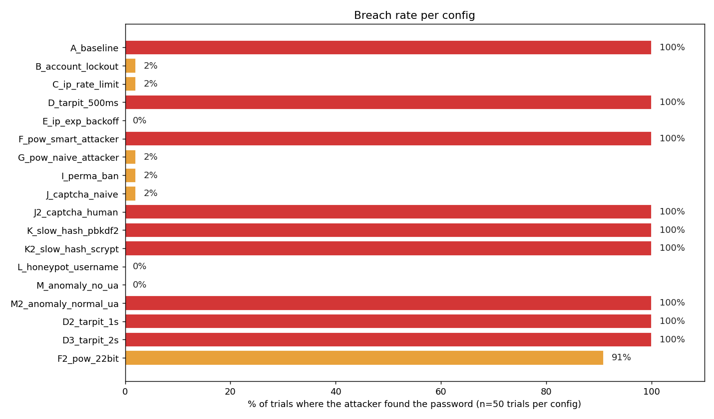
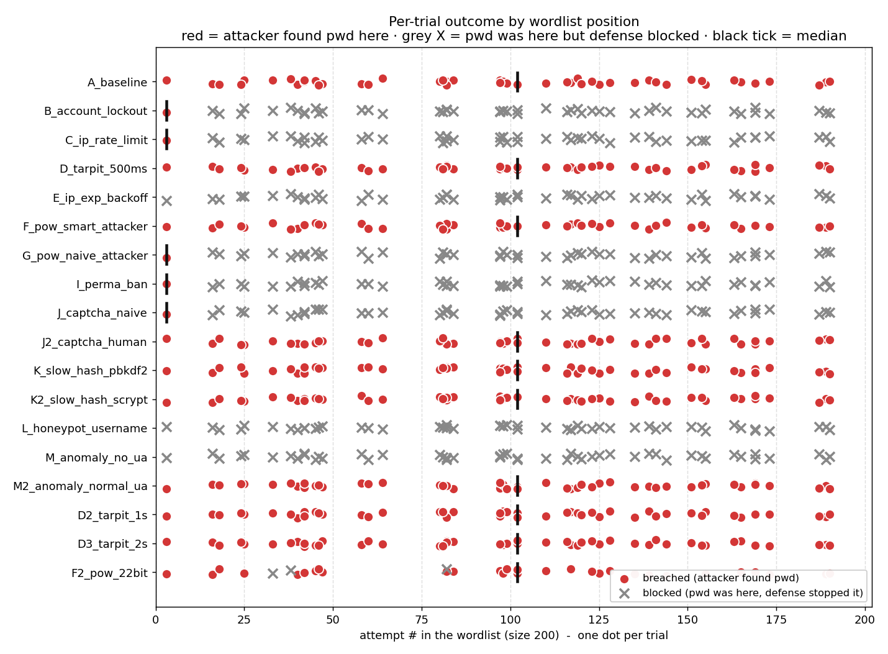
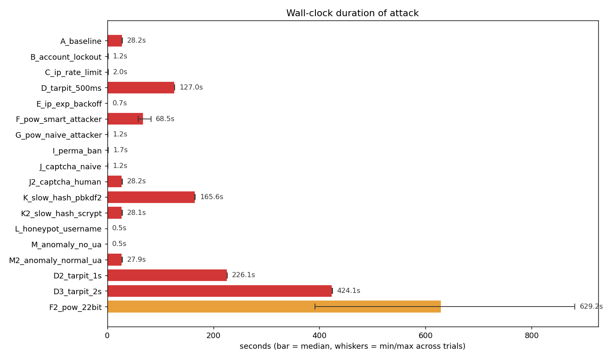
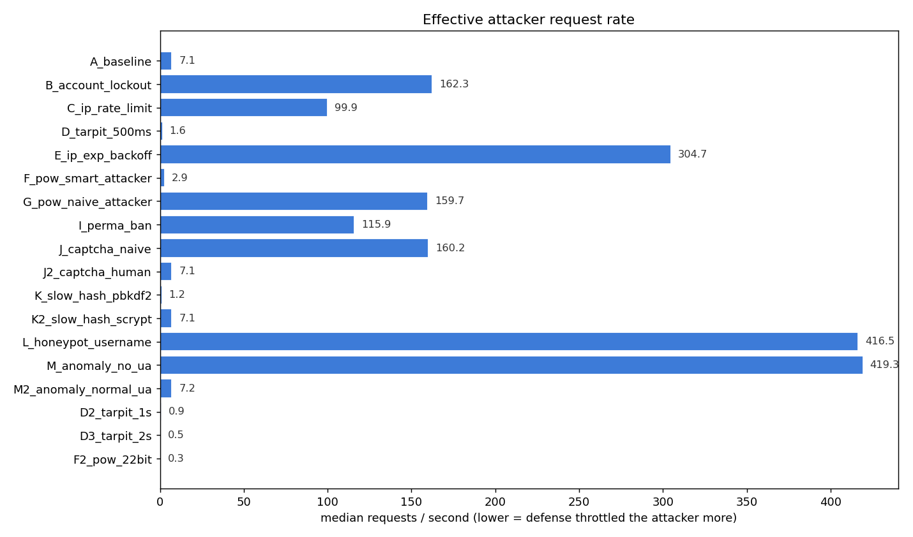
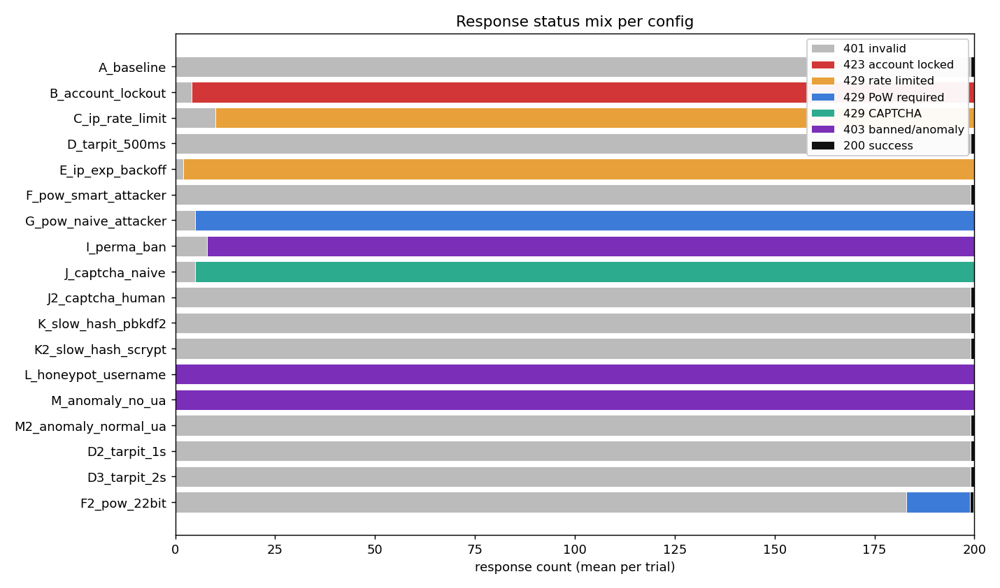
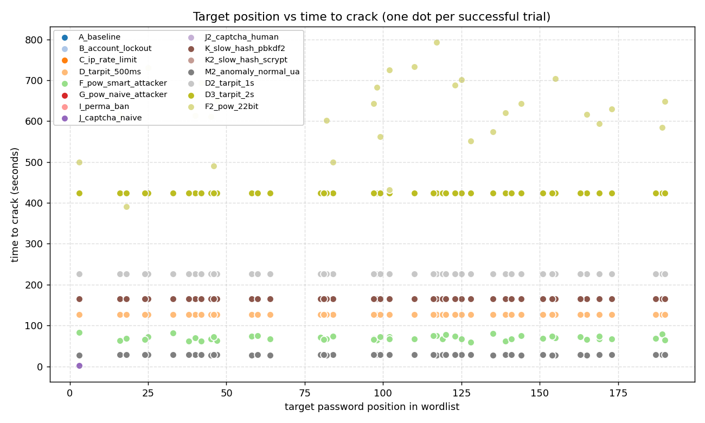

# Login Lab Defense Benchmark - 20260428T164727Z

- Wordlist source: `passwords/raw/SecLists/Common-Credentials/10k-most-common.txt` (200 entries per generated wordlist)
- Trials per config: **50** (target inserted at random position each trial)
- Base RNG seed: `-1`
- Total suite runtime: **21h 31m 50s** across 883 trials (avg 87.8s/trial; _wall-clock_)

## Verdict matrix

| config | category | breach % | med elapsed | min..max | med req/s | med pos | trials | description |
|---|---|---|---|---|---|---|---|---|
| `A_baseline` | none | 100% **COMPROMISED** | 28.20s | 27.9..28.4 | 7.09 | 100 | 50 | No protections - pure baseline |
| `B_account_lockout` | single | 2% **partial** | 1.23s | 1.0..1.7 | 162.34 | 3 | 50 | Account lockout (5 fail -> 60s) |
| `C_ip_rate_limit` | single | 2% **partial** | 2.00s | 1.7..2.1 | 99.89 | 3 | 50 | IP rate limit (10 / 30s) |
| `D_tarpit_500ms` | single | 100% **COMPROMISED** | 127.05s | 126.9..127.4 | 1.57 | 100 | 50 | Tarpit 0.5s per failure |
| `E_ip_exp_backoff` | single | 0% blocked | 0.66s | 0.6..0.7 | 304.72 | - | 50 | IP exponential backoff (0.25s, cap 8s) |
| `F_pow_smart_attacker` | single | 100% **COMPROMISED** | 68.49s | 58.6..83.0 | 2.92 | 100 | 50 | PoW 18-bit after 5 fails (attacker solves) |
| `G_pow_naive_attacker` | single | 2% **partial** | 1.25s | 1.0..1.5 | 159.72 | 3 | 50 | PoW 18-bit after 5 fails (naive attacker) |
| `I_perma_ban` | single | 2% **partial** | 1.73s | 1.5..1.9 | 115.88 | 3 | 50 | Permanent IP ban after 8 fails / 1h |
| `J_captcha_naive` | single | 2% **partial** | 1.25s | 1.0..1.4 | 160.20 | 3 | 50 | CAPTCHA after 5 fails (naive attacker - no solver) |
| `J2_captcha_human` | single | 100% **COMPROMISED** | 28.19s | 28.1..28.3 | 7.09 | 100 | 50 | CAPTCHA after 5 fails (human-in-loop attacker solves) |
| `K_slow_hash_pbkdf2` | single | 100% **COMPROMISED** | 165.57s | 165.2..165.8 | 1.21 | 100 | 50 | Slow password hash (pbkdf2:sha256:600000) |
| `K2_slow_hash_scrypt` | single | 100% **COMPROMISED** | 28.06s | 27.9..28.2 | 7.13 | 100 | 50 | Slow password hash (scrypt:32768:8:1) |
| `L_honeypot_username` | single | 0% blocked | 0.48s | 0.4..0.5 | 416.48 | - | 50 | Honeypot usernames (attacker hits 'admin') |
| `M_anomaly_no_ua` | single | 0% blocked | 0.48s | 0.5..0.5 | 419.31 | - | 50 | Anomaly detection (attacker omits User-Agent) |
| `M2_anomaly_normal_ua` | single | 100% **COMPROMISED** | 27.95s | 27.6..28.2 | 7.16 | 100 | 50 | Anomaly detection (attacker sends normal User-Agent) |
| `D2_tarpit_1s` | variant | 100% **COMPROMISED** | 226.11s | 225.8..226.3 | 0.88 | 100 | 50 | Tarpit 1s per failure |
| `D3_tarpit_2s` | variant | 100% **COMPROMISED** | 424.08s | 423.9..424.3 | 0.47 | 100 | 50 | Tarpit 2s per failure |
| `F2_pow_22bit` | variant | 91% **partial** | 629.18s | 391.4..881.5 | 0.32 | 102 | 33 | PoW 22-bit after 5 fails (smart attacker) |

## Charts

## Mechanisms in the lab

- **Account lockout** - after N consecutive failures, the account is frozen.
- **IP rate limit** - caps attempts per IP in a sliding window.
- **Tarpit** - artificial server-side sleep on every failed response.
- **IP exponential backoff** - per-IP cooldown that doubles with each failure.
- **Proof-of-Work** - server demands a SHA-256 puzzle after N failures.
- **Permanent IP ban** - blacklist after K failures within a window.
- **CAPTCHA** - server demands a human-solvable token after N failures.
- **Slow password hash** - pbkdf2 / scrypt to inflate per-attempt CPU cost.
- **Honeypot usernames** - contact with watched usernames triggers an instant ban.
- **Anomaly detection** - block requests missing typical browser headers.