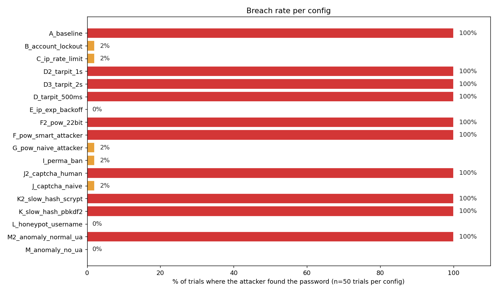
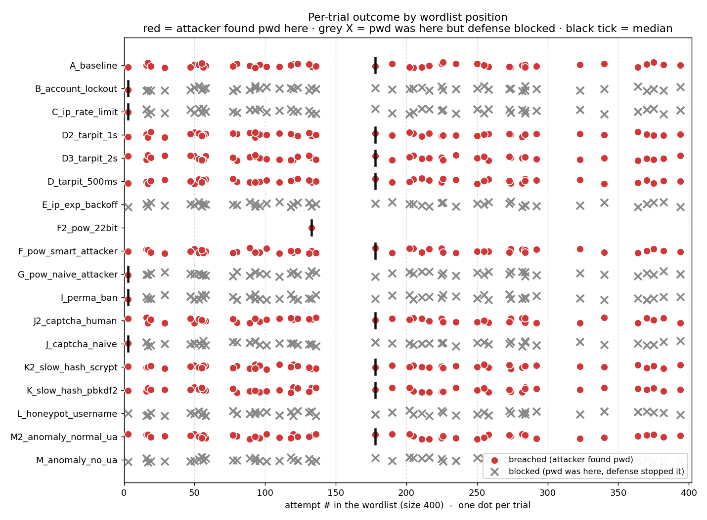
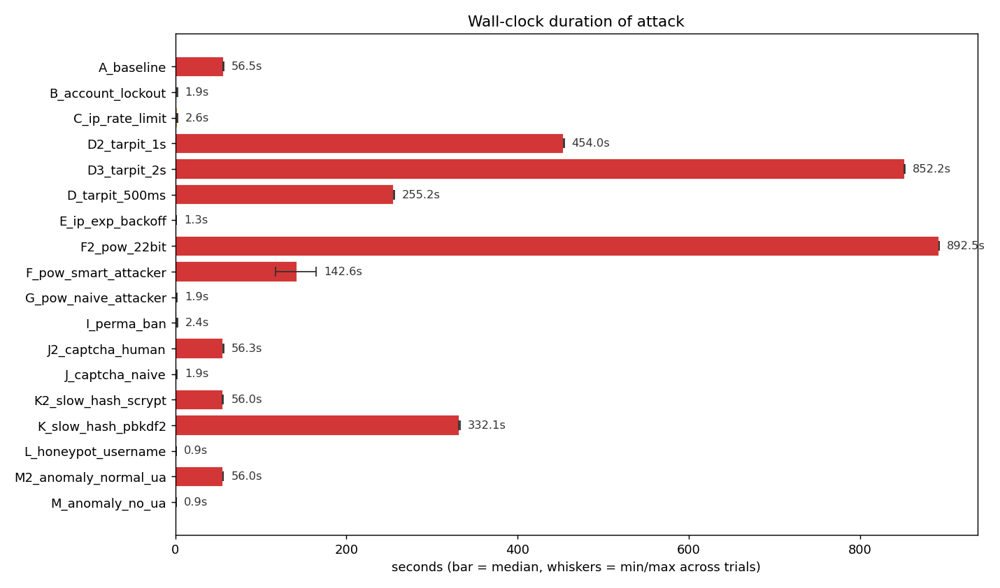
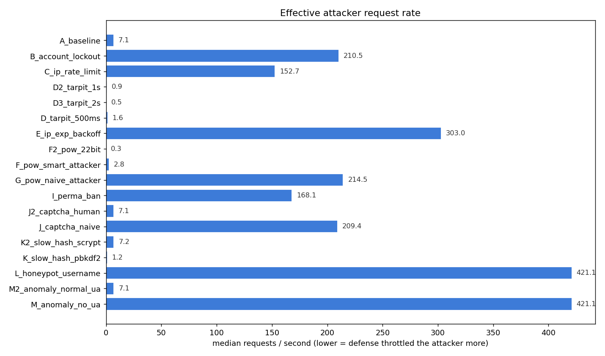
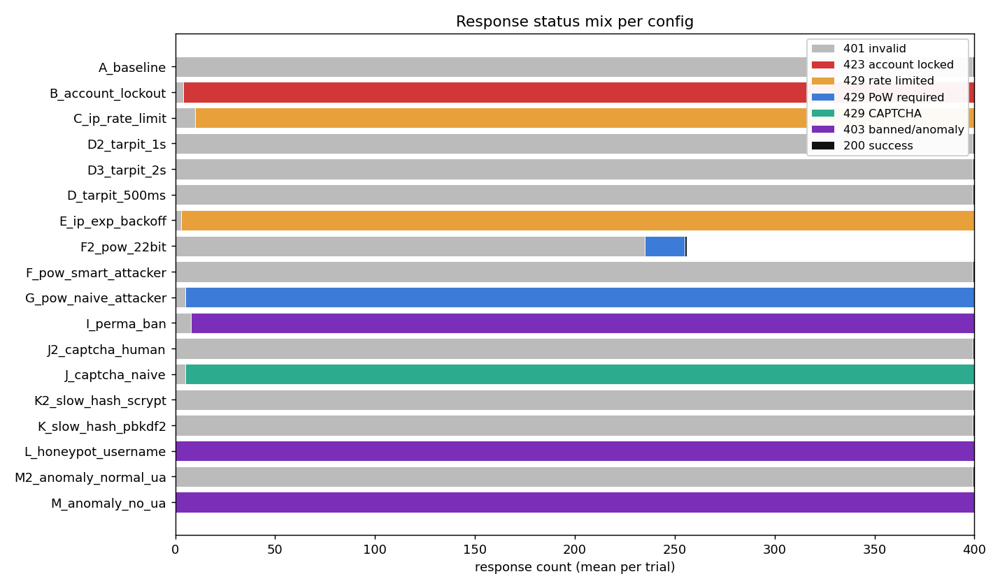
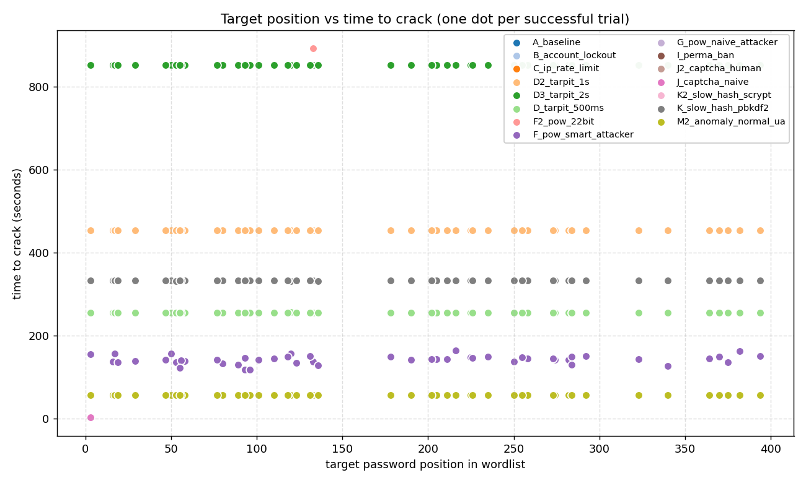

# Login Lab Defense Benchmark - 20260428T164751Z

- Wordlist source: `(recovered - see per-trial wordlists)` (400 entries per generated wordlist)
- Trials per config: **50** (target inserted at random position each trial)
- Base RNG seed: `-1`
- Total suite runtime: **32h 6m 49s** across 851 trials (avg 135.9s/trial; _wall-clock_)

## Verdict matrix

| config | category | breach % | med elapsed | min..max | med req/s | med pos | trials | description |
|---|---|---|---|---|---|---|---|---|
| `A_baseline` | none | 100% **COMPROMISED** | 56.50s | 56.0..57.0 | 7.08 | 157 | 50 | No protections - pure baseline |
| `B_account_lockout` | single | 2% **partial** | 1.90s | 1.5..2.4 | 210.53 | 3 | 50 | Account lockout (5 fail -> 60s) |
| `C_ip_rate_limit` | single | 2% **partial** | 2.62s | 2.1..2.8 | 152.67 | 3 | 50 | IP rate limit (10 / 30s) |
| `D2_tarpit_1s` | variant | 100% **COMPROMISED** | 454.04s | 453.6..454.4 | 0.88 | 157 | 50 | Tarpit 1s per failure |
| `D3_tarpit_2s` | variant | 100% **COMPROMISED** | 852.19s | 852.0..852.5 | 0.47 | 157 | 50 | Tarpit 2s per failure |
| `D_tarpit_500ms` | single | 100% **COMPROMISED** | 255.18s | 254.9..255.7 | 1.57 | 157 | 50 | Tarpit 0.5s per failure |
| `E_ip_exp_backoff` | single | 0% blocked | 1.32s | 1.2..1.5 | 303.03 | - | 50 | IP exponential backoff (0.25s, cap 8s) |
| `F2_pow_22bit` | variant | 100% **COMPROMISED** | 892.54s | 892.5..892.5 | 0.29 | 133 | 1 | PoW 22-bit after 5 fails (smart attacker) |
| `F_pow_smart_attacker` | single | 100% **COMPROMISED** | 142.59s | 117.2..164.5 | 2.80 | 157 | 50 | PoW 18-bit after 5 fails (attacker solves) |
| `G_pow_naive_attacker` | single | 2% **partial** | 1.87s | 1.5..2.1 | 214.48 | 3 | 50 | PoW 18-bit after 5 fails (naive attacker) |
| `I_perma_ban` | single | 2% **partial** | 2.38s | 2.0..2.5 | 168.07 | 3 | 50 | Permanent IP ban after 8 fails / 1h |
| `J2_captcha_human` | single | 100% **COMPROMISED** | 56.30s | 56.0..56.6 | 7.10 | 157 | 50 | CAPTCHA after 5 fails (human-in-loop attacker solves) |
| `J_captcha_naive` | single | 2% **partial** | 1.91s | 1.5..2.0 | 209.43 | 3 | 50 | CAPTCHA after 5 fails (naive attacker - no solver) |
| `K2_slow_hash_scrypt` | single | 100% **COMPROMISED** | 55.95s | 55.5..56.2 | 7.15 | 157 | 50 | Slow password hash (scrypt:32768:8:1) |
| `K_slow_hash_pbkdf2` | single | 100% **COMPROMISED** | 332.09s | 331.6..332.5 | 1.20 | 157 | 50 | Slow password hash (pbkdf2:sha256:600000) |
| `L_honeypot_username` | single | 0% blocked | 0.95s | 0.9..1.0 | 421.05 | - | 50 | Honeypot usernames (attacker hits 'admin') |
| `M2_anomaly_normal_ua` | single | 100% **COMPROMISED** | 56.01s | 55.6..56.3 | 7.14 | 157 | 50 | Anomaly detection (attacker sends normal User-Agent) |
| `M_anomaly_no_ua` | single | 0% blocked | 0.95s | 0.9..1.0 | 421.05 | - | 50 | Anomaly detection (attacker omits User-Agent) |

## Charts

## Mechanisms in the lab

- **Account lockout** - after N consecutive failures, the account is frozen.
- **IP rate limit** - caps attempts per IP in a sliding window.
- **Tarpit** - artificial server-side sleep on every failed response.
- **IP exponential backoff** - per-IP cooldown that doubles with each failure.
- **Proof-of-Work** - server demands a SHA-256 puzzle after N failures.
- **Permanent IP ban** - blacklist after K failures within a window.
- **CAPTCHA** - server demands a human-solvable token after N failures.
- **Slow password hash** - pbkdf2 / scrypt to inflate per-attempt CPU cost.
- **Honeypot usernames** - contact with watched usernames triggers an instant ban.
- **Anomaly detection** - block requests missing typical browser headers.