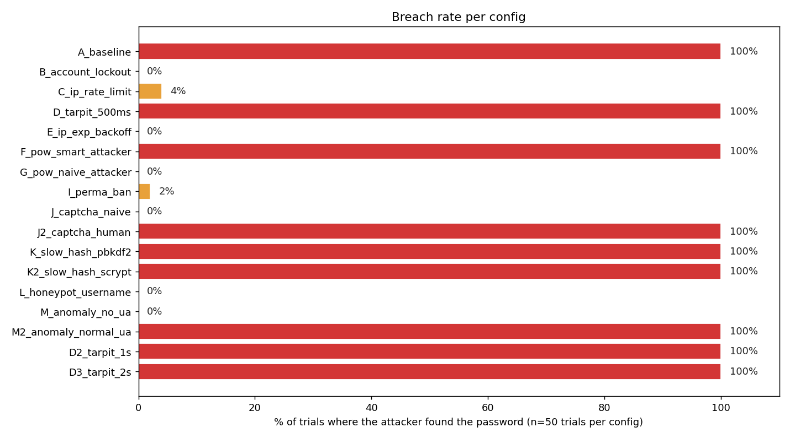
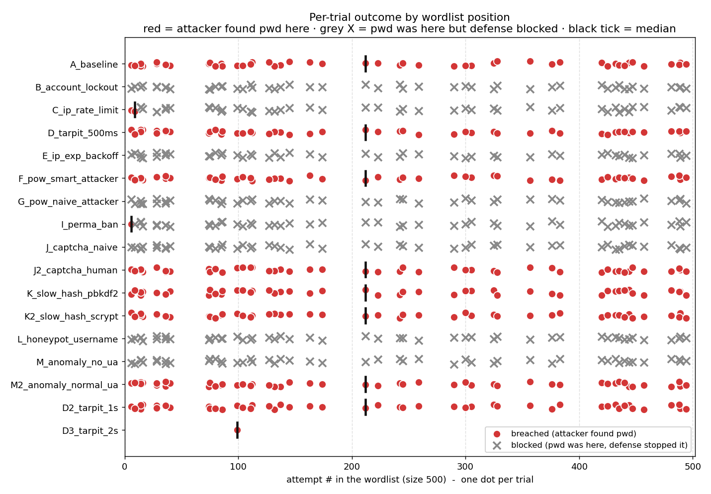
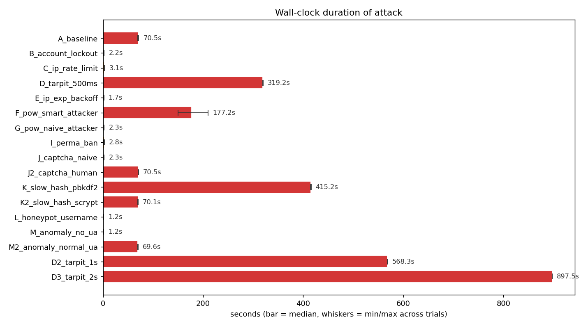
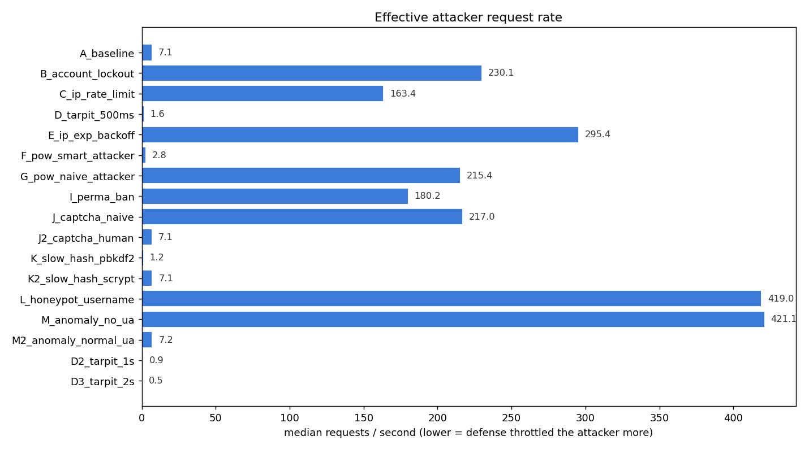
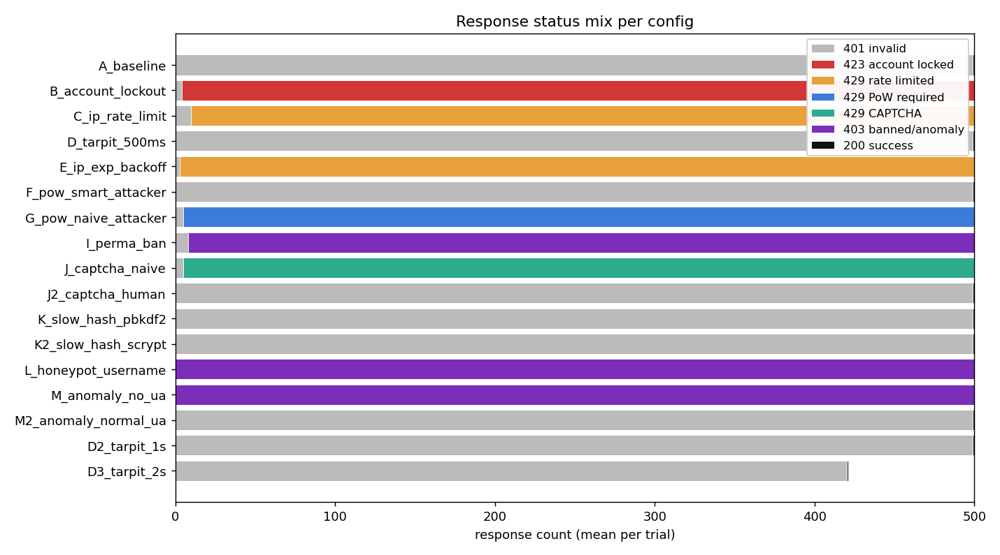
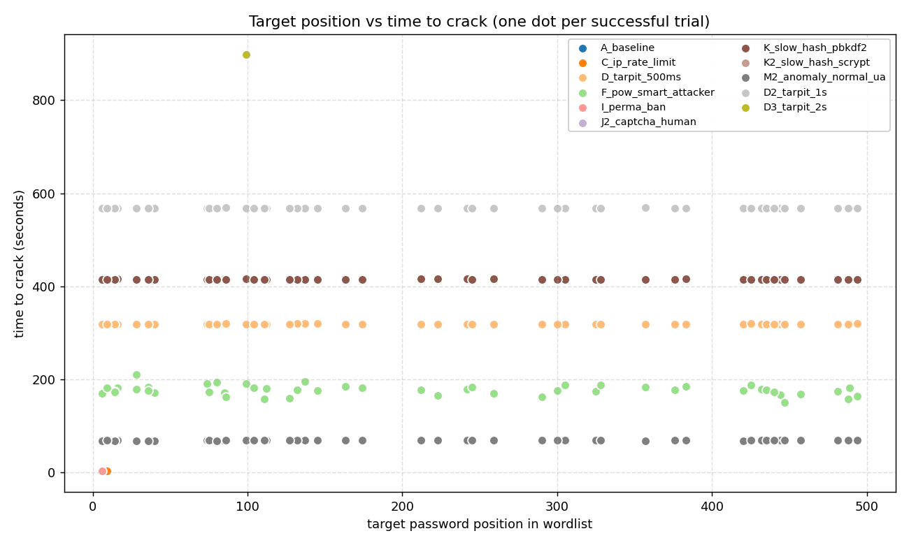

# Login Lab Defense Benchmark - 20260428T164809Z

- Wordlist source: `passwords/raw/SecLists/Common-Credentials/10k-most-common.txt` (500 entries per generated wordlist)
- Trials per config: **50** (target inserted at random position each trial)
- Base RNG seed: `-1`
- Total suite runtime: **24h 55m 48s** across 801 trials (avg 112.0s/trial; _wall-clock_)

## Verdict matrix

| config | category | breach % | med elapsed | min..max | med req/s | med pos | trials | description |
|---|---|---|---|---|---|---|---|---|
| `A_baseline` | none | 100% **COMPROMISED** | 70.47s | 69.5..71.4 | 7.10 | 193 | 50 | No protections - pure baseline |
| `B_account_lockout` | single | 0% blocked | 2.17s | 1.8..2.4 | 230.13 | - | 50 | Account lockout (5 fail -> 60s) |
| `C_ip_rate_limit` | single | 4% **partial** | 3.06s | 2.6..3.3 | 163.44 | 8 | 50 | IP rate limit (10 / 30s) |
| `D_tarpit_500ms` | single | 100% **COMPROMISED** | 319.24s | 318.8..319.8 | 1.57 | 193 | 50 | Tarpit 0.5s per failure |
| `E_ip_exp_backoff` | single | 0% blocked | 1.69s | 1.5..1.8 | 295.45 | - | 50 | IP exponential backoff (0.25s, cap 8s) |
| `F_pow_smart_attacker` | single | 100% **COMPROMISED** | 177.25s | 150.1..210.0 | 2.82 | 193 | 50 | PoW 18-bit after 5 fails (attacker solves) |
| `G_pow_naive_attacker` | single | 0% blocked | 2.32s | 1.9..2.4 | 215.43 | - | 50 | PoW 18-bit after 5 fails (naive attacker) |
| `I_perma_ban` | single | 2% **partial** | 2.77s | 2.4..3.0 | 180.15 | 6 | 50 | Permanent IP ban after 8 fails / 1h |
| `J_captcha_naive` | single | 0% blocked | 2.30s | 1.8..2.4 | 216.99 | - | 50 | CAPTCHA after 5 fails (naive attacker - no solver) |
| `J2_captcha_human` | single | 100% **COMPROMISED** | 70.50s | 70.2..70.7 | 7.09 | 193 | 50 | CAPTCHA after 5 fails (human-in-loop attacker solves) |
| `K_slow_hash_pbkdf2` | single | 100% **COMPROMISED** | 415.25s | 414.4..415.8 | 1.20 | 193 | 50 | Slow password hash (pbkdf2:sha256:600000) |
| `K2_slow_hash_scrypt` | single | 100% **COMPROMISED** | 70.10s | 69.5..70.3 | 7.13 | 193 | 50 | Slow password hash (scrypt:32768:8:1) |
| `L_honeypot_username` | single | 0% blocked | 1.19s | 1.1..1.4 | 419.00 | - | 50 | Honeypot usernames (attacker hits 'admin') |
| `M_anomaly_no_ua` | single | 0% blocked | 1.19s | 1.1..1.3 | 421.11 | - | 50 | Anomaly detection (attacker omits User-Agent) |
| `M2_anomaly_normal_ua` | single | 100% **COMPROMISED** | 69.60s | 68.6..70.0 | 7.18 | 193 | 50 | Anomaly detection (attacker sends normal User-Agent) |
| `D2_tarpit_1s` | variant | 100% **COMPROMISED** | 568.27s | 567.9..568.7 | 0.88 | 193 | 50 | Tarpit 1s per failure |
| `D3_tarpit_2s` | variant | 100% **COMPROMISED** | 897.52s | 897.5..897.5 | 0.47 | 99 | 1 | Tarpit 2s per failure |

## Charts

## Mechanisms in the lab

- **Account lockout** - after N consecutive failures, the account is frozen.
- **IP rate limit** - caps attempts per IP in a sliding window.
- **Tarpit** - artificial server-side sleep on every failed response.
- **IP exponential backoff** - per-IP cooldown that doubles with each failure.
- **Proof-of-Work** - server demands a SHA-256 puzzle after N failures.
- **Permanent IP ban** - blacklist after K failures within a window.
- **CAPTCHA** - server demands a human-solvable token after N failures.
- **Slow password hash** - pbkdf2 / scrypt to inflate per-attempt CPU cost.
- **Honeypot usernames** - contact with watched usernames triggers an instant ban.
- **Anomaly detection** - block requests missing typical browser headers.